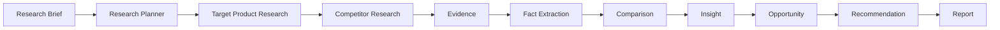
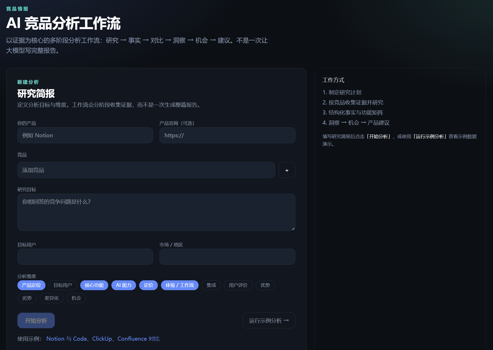
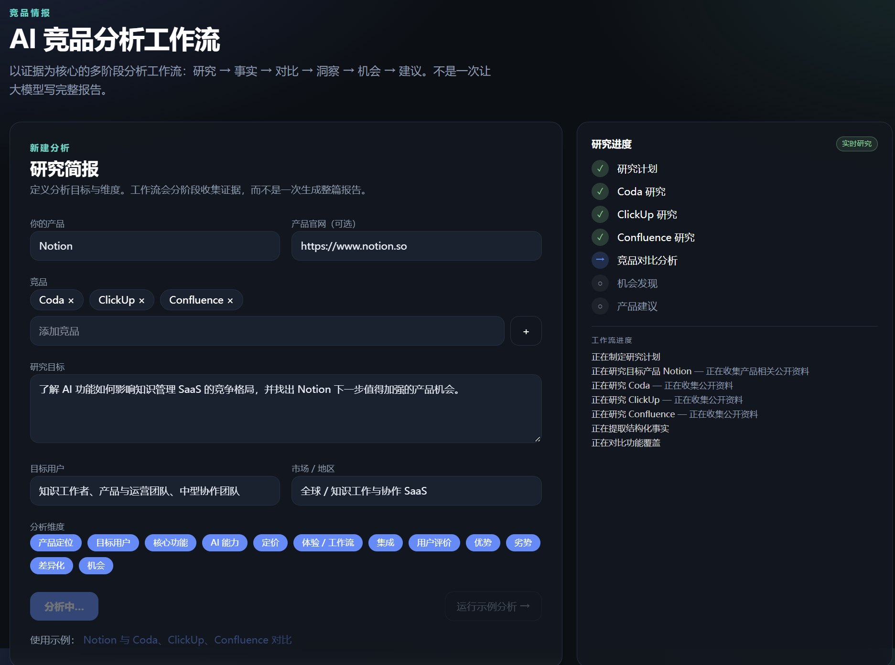
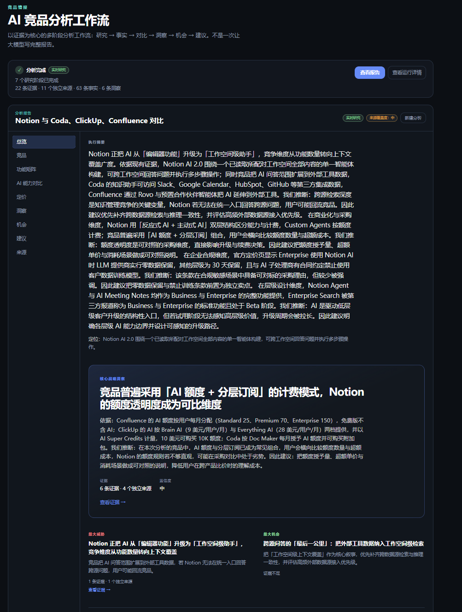
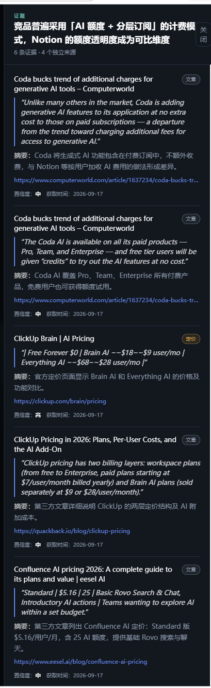
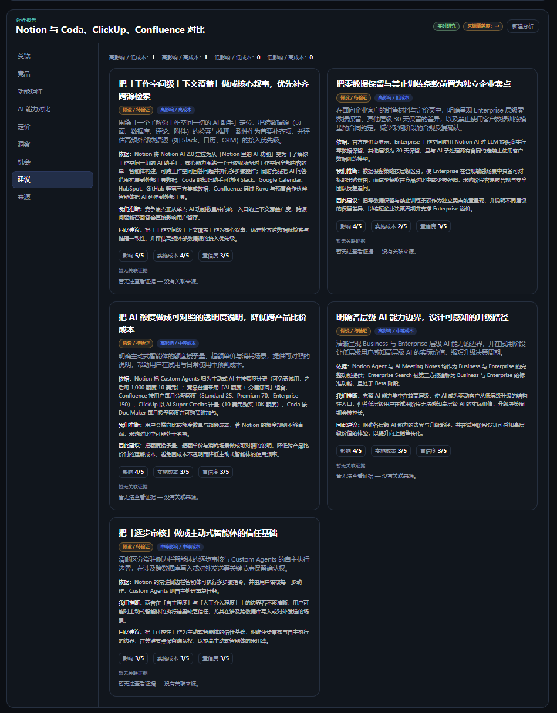

# AI 竞品分析工作流

一个 Evidence-first 的 AI 竞品研究与决策工作流：从公开信息研究到事实提取、结构化对比、洞察、机会与产品建议，并允许用户追溯关键结论的真实来源。

**不是**「让 AI 写一份竞品报告」，而是把竞品分析拆成可验证、可追溯的决策链路。

| | |
| --- | --- |
| **Live Demo** | [LIVE_DEMO_URL](LIVE_DEMO_URL) |
| **GitHub** | [CRISZJB/ai-competitive-intelligence](https://github.com/CRISZJB/ai-competitive-intelligence) |
| **项目状态** | MVP Sealed |
| **项目类型** | AI Product / Portfolio Project |

> Live Demo 链接待部署后替换 `LIVE_DEMO_URL`。

---

## 为什么做

普通 LLM 可以快速生成竞品报告，但常见问题包括：

- 事实与推断混在一起
- 关键结论难以追溯
- 搜不到信息时容易把「未知」写成「不存在」
- 证据质量不同，结论语气却一样强
- 一个 mega prompt 很难控制中间推理质量

因此本项目的目标不是：

> 让 AI 写一份竞品报告

而是：

> 把竞品分析拆成可验证、可追溯的决策工作流

核心约束：**Evidence → Fact → Insight → Recommendation** 必须可追溯。

---

## 核心 Workflow



Traceability chain：

```text
Evidence
  → Fact
    → Insight
      → Recommendation
```

目标产品（Target Product）与竞品走同一套 research pipeline，避免「竞品有 X → 推断目标产品没有 X」。

---

## 产品体验

### 1. 定义研究问题



用户输入产品、竞品、研究目标、目标用户、市场与分析维度，形成一次可执行的 Research Brief。

### 2. 分阶段实时研究



研究计划、目标产品研究、竞品研究、结构化事实、竞品对比、机会发现与产品建议按阶段推进，并支持 NDJSON 流式进度。

### 3. 决策型 Overview



报告总览不堆砌全部生成文本，而是突出决策所需信息：

- 执行摘要
- 核心战略洞察
- 最大威胁
- 最大机会
- 下一步建议
- Supporting Findings

### 4. Evidence-first



关键 Insight / Recommendation 可打开 Evidence Drawer，追溯至：

- source
- source type
- quote（保留原文）
- summary（中文摘要）
- confidence
- URL

### 5. Product Recommendation



Recommendation 采用可审计推理结构：

```text
Because（依据）
  → We infer（我们推断）
    → Therefore（因此建议）
```

并展示 Impact、Effort、Confidence 与关联 Evidence。证据不足时标记「假设 / 待验证」，不强行伪装成已证实结论。

---

## Trust & Guardrails

### Source Authority

`official` / `documentation` / `pricing` 优先于 `article` / `review`。来源权威不等于 claim 相关——官方页面也可能与当前主张无关。

### Evidence Deduplication

同一 URL 规范化后只计为一个 unique source；UI 展示「X 条证据 · Y 个独立来源」。

### Claim–Evidence Entailment

来源属于同一产品，不等于能支持该 claim。只有直接语义支持的 Evidence 才会进入 supporting evidence。

### Confidence Propagation

Recommendation 的 Confidence 不能无依据高于 supporting Insight；除非存在额外独立高质量证据，否则受上游天花板约束。

### Score Abstention

证据不足时不强行输出评分；Comparison / Feature Matrix 显示「证据不足」并 abstain。

### Absence-of-Evidence Guardrail

「没有搜索到 X」≠「产品不存在 X」。

优先表述为：未找到足够证据表明……（假设 / 待验证）。

### Target Product Research

目标产品独立研究，与 competitors 使用相同 pipeline，避免缺证推断。

---

## Research Modes

| 模式 | 何时出现 | 行为 |
| --- | --- | --- |
| **Demo / Sample Data**（演示 / 示例数据） | `mode: "demo"`，或无法走实时研究路径 | 使用确定性示例数据集，可离线演示 |
| **Limited Research**（有限研究） | 请求 Live，但缺少完整检索密钥（如无 `TAVILY_API_KEY`） | LLM 可用，但检索不完整 |
| **Live Research**（实时研究） | Live + LLM Key + `TAVILY_API_KEY` | 真实网页检索 + 结构化分析 |

仅有 LLM API Key **不能**被标为完整 Live Research。

报告另有独立的 **来源覆盖度：高 / 中 / 低**，表示研究深度，不等于每条 Insight 都是高置信。

---

## Architecture

```text
User
  ↓
Next.js UI
  ↓
Competitive Analysis API（NDJSON）
  ↓
Workflow Orchestrator
  ↓
Research Provider（Tavily）
  +
LLM Provider（DeepSeek）
  ↓
Structured Output + Zod
  ↓
Evidence Store
  ↓
Fact / Insight / Opportunity / Recommendation
  ↓
Report Workspace + Evidence Drawer
```

---

## Tech Stack

- Next.js 15（App Router）
- React 19
- TypeScript
- Tailwind CSS
- Zod
- DeepSeek API（OpenAI-compatible）
- Tavily Search API
- NDJSON Streaming

---

## Local Setup

```bash
npm install
```

复制环境变量模板：

```bash
cp .env.example .env.local
```

在 `.env.local` 中配置（**只写变量名，不要提交真实 Key**）：

```env
DEEPSEEK_API_KEY=
LLM_MODEL=
TAVILY_API_KEY=
```

启动：

```bash
npm run dev
```

本地开发地址：`http://localhost:3000`（仅用于本地调试，不是 Live Demo）。

操作路径：填写研究简报 → **开始分析**，或 **运行示例分析** / **使用示例** 预填 Notion 场景。

---

## Validation

当前稳定基线：

```bash
npm run lint
npm run build
npm run test:consistency
```

Consistency regression 覆盖：

- UUID / internal ID sanitization
- resolved Evidence 计数
- Confidence propagation
- Claim–Evidence entailment
- Absence-of-evidence guardrail
- Score abstention
- Claim scope 对齐

---

## Current Status

**MVP Sealed**

已完成并验证：

- Live web research（DeepSeek + Tavily）
- Target Product + Competitor research
- Evidence traceability
- Structured comparison / Feature Matrix
- Insight / Opportunity / Recommendation 生成
- Trust guardrails
- 简体中文默认输出与 UI

尚未验证（请勿当作产品效果 claim）：

- 真实竞品分析从业者的长期使用价值
- 相比人工竞品研究的时间节省
- 建议对真实产品决策的长期影响

---

## Product Decisions / Trade-offs

本轮**主动没有优先做**：

- 登录 / 账号体系
- 数据库持久化
- 多人协作
- PDF 导出
- Multi-agent framework
- 更多 AI Provider

原因：先验证 **Evidence → Decision** 的核心链路与可信度，而不是用功能数量堆作品集。

---

## Roadmap

1. 真实用户研究
2. 研究 source coverage / trust perception
3. 保存分析历史
4. 人工审核与 fact locking
5. 再考虑团队协作与导出能力

---

## 截图资产

请将作品集截图放入 `docs/images/`：

| 文件 | 用途 |
| --- | --- |
| `research-brief.png` | README 引用 |
| `workflow-progress.png` | README 引用 |
| `overview.png` | README 引用 |
| `evidence-drawer.png` | README 引用 |
| `recommendations.png` | README 引用 |
| `competitors.png` | 可选补充 |
| `feature-matrix.png` | 可选补充 |
| `ai-comparison.png` | 可选补充 |
| `pricing.png` | 可选补充 |
| `insights.png` | 可选补充 |
| `opportunities.png` | 可选补充 |
| `sources.png` | 可选补充 |

---

## License

Private portfolio project. All rights reserved unless otherwise stated.
